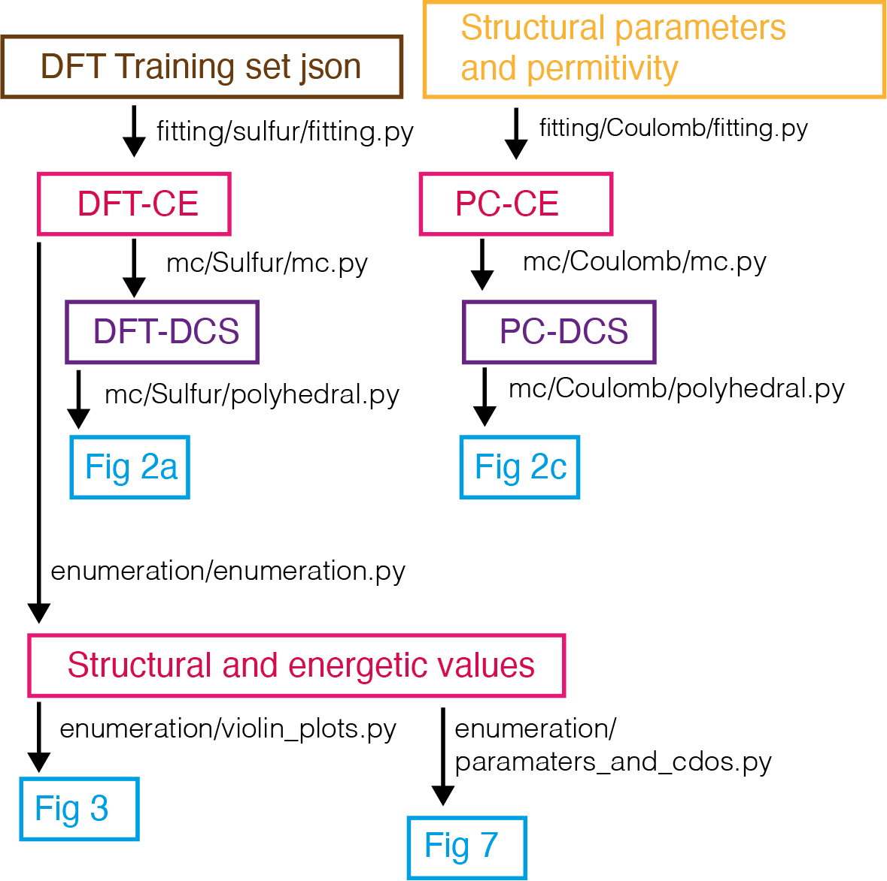

# Data analysis for &ldquo;Anion-polarisation&mdash;directed short-range-order in antiperovskite Li2FeSO&rdquo;

Authors:
- Samuel W. Coles (Wrote workflow)
- Viktoria Falkowski
- Harry S. Geddes
- Gabriel E. Pérez
- Samuel G. Booth
- Alexander G. Squires 
- Conn O'Rourke
- Kit McColl
- Andrew L. Goodwin
- Serena A. Cussen
- Simon J. Clarke
- M. Saiful Islam
- Benjamin J. Morgan

## Summary

This repository contains the analysis workflow for our preprint "Anion-polarisation&mdash;directed short-range-order in antiperovskite Li2FeSO” [LINK GOES HERE].

The workflow consists of three main components: fitting, enumeration, and Monte Carlo (MC), with each applied to a point-charge model and DFT-derived cluster expansion model. A random arrangement of cations is also generated for comparison with the Monte Carlo data. 

There are three main subsections of the workflow: `fitting`, `mc`, and `enumeration`, illustrated in the diagram below. 
A conda yaml file is provided describing the exact environments in which calculations were initially run.

## Fitting

Fitting and all subsequent calculations are performed using the [icet](https://icet.materialsmodeling.org) linrary. Data from DFT calculations are input in json format and fit using the python scripts. The output from this step is a cluster expansion object for DFT energies. In parallel a cluster expansion is fit using Ewald energies in the coulomb tab.

## MC

Monte Carlo simulations are performed for 8&times;8&times;8 supercells using the two fitted cluster expansions using the mchammer library installed as part of icet. The Monte Carlo simulation outputs mc data container objects which are then processed by polyhedral.py using the [polyhedral analysis](https://polyhedral-analysis.readthedocs.io/en/latest/) library to generate the octahedral coordination population figures.

## Enumeration

The final stage, enumeration, focusses on the direct calculation of the partition function. In enumeration.py the different supercells of a 2&times;2&times;2 expansion of the Li2FeSO primitive are obtained using [bsym](https://joss.theoj.org/papers/10.21105/joss.00370), the degeneracy of structures is obtained using this process. The energies of these structures are calculated along with key structural parameters used to obtain order parameters. In two subsequent scripts violins.py and parameters_and_cdos.py we obtain Fig. 3 and Fig. 7 directly. paramaters_and_cdos.py handles the calculation of temperature dependent order parameters and the thermal population density of states at 1025 K for both cluster expansions.

## Workflow scheme

The DFT dataset supporting this analysis will be made available on the University of Bath Research Data Archive.
